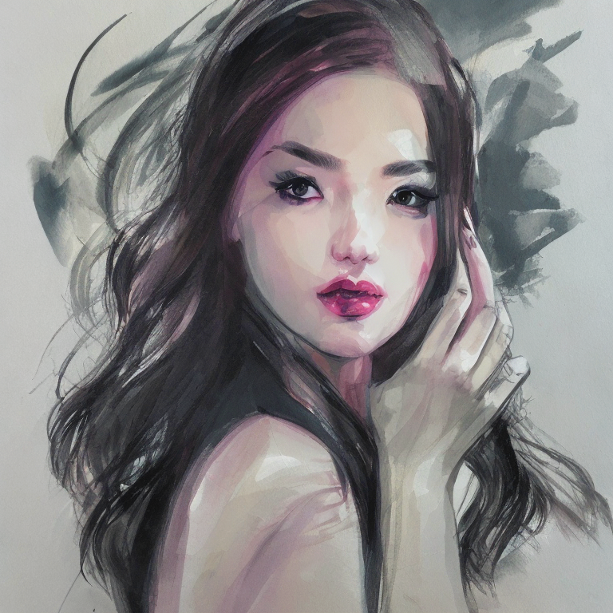
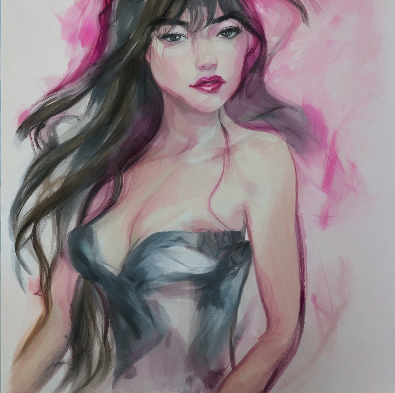
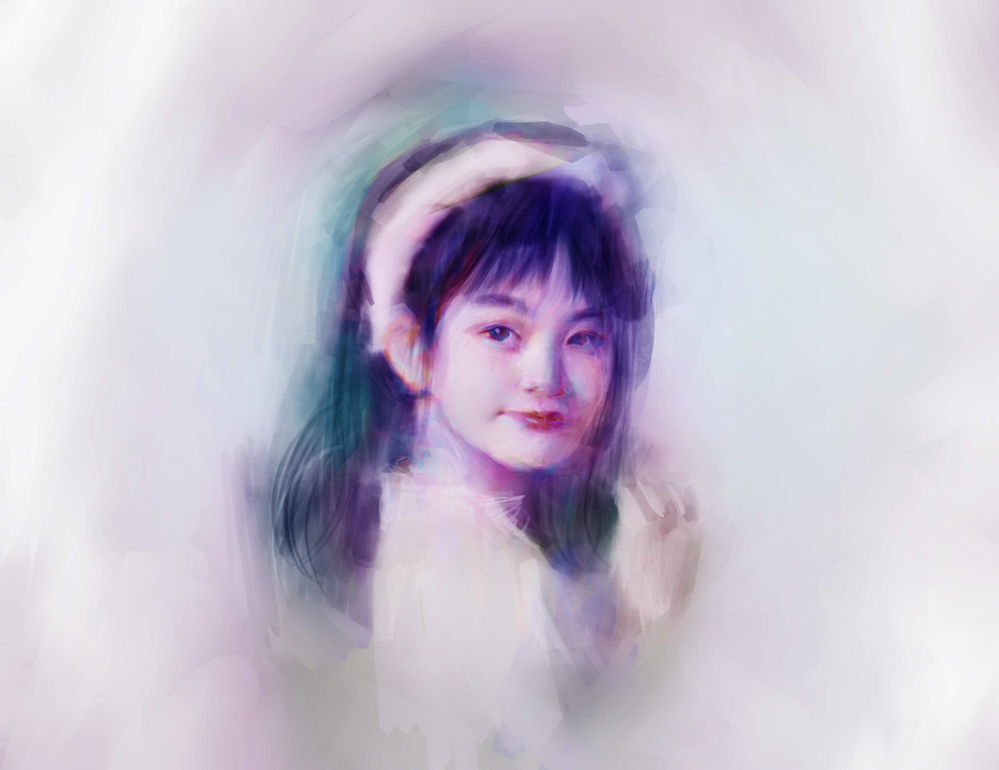
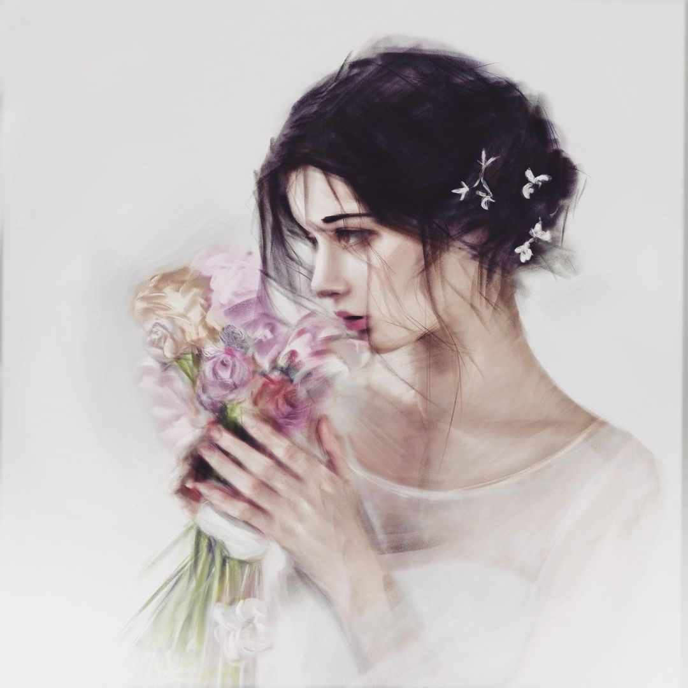
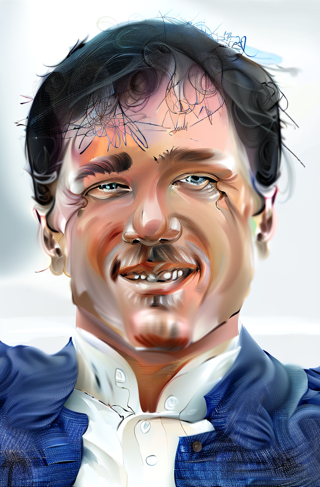
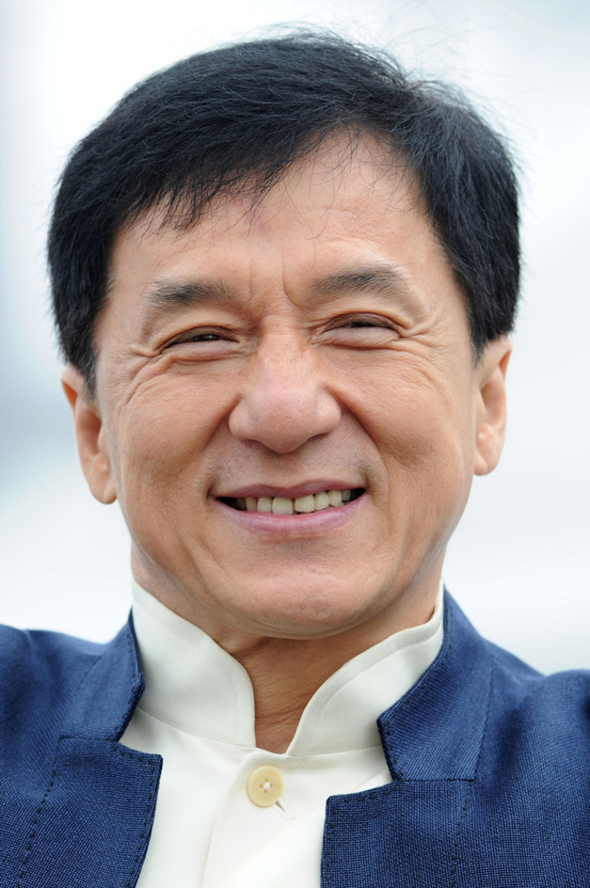

# sd-concepts-library-buhu-art-style

This repository contains a trainning script that fetch the list of art work produced by [Bruce](https://bruceelysium.com) and a Stable Diffusion pipe that generates images using the model, under the instruction of [Stable Diffusion concepts library](https://huggingface.co/sd-concepts-library). 

## Usage

-  Open Stable Diffusion usage pipe in Colab. Modify your prompt at the end of the notebook for tex2img.  
-   Open Stable Diffusion usage pipe in Colab. Modify your prompt at the end of the notebook for img2img. 
-  Load pre-trainned model.
-   (Optional) if you want to train the model by yourself, use the Model Trainner.

## Example
### text2image
generated image

\
human painted  image

\
### img2img

 

